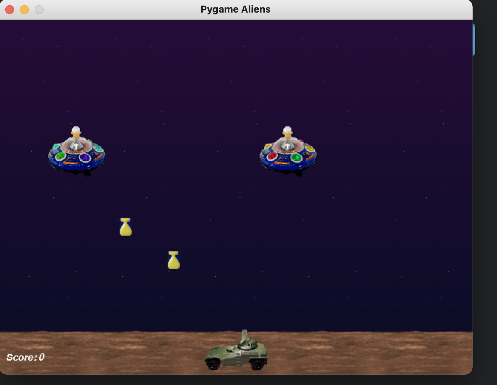
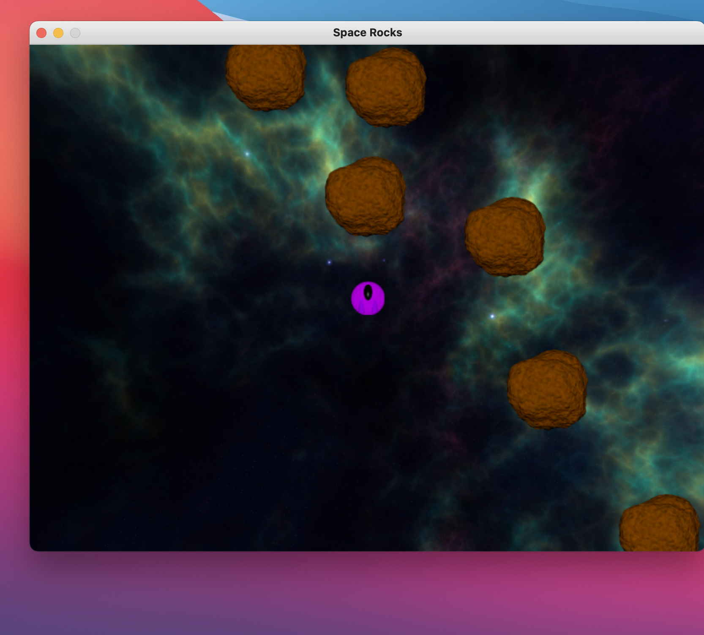
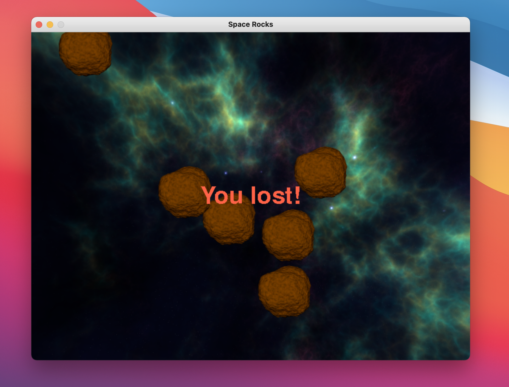

# Space Rocks

A simple space game made with Python and Pygame. Game inspiration comes
from [here](https://www.youtube.com/watch?v=WYSupJ5r2zo)

## Prerequisits

This being a Python Game, Python essentially needs to be installed. preferrably Python 3.8 & up, but any version of
Python 3.+ should work just fine.

Once you have Python installed, the installation of dependencies should be straightforward. You can either
use [Pipenv](https://pypi.org/project/pipenv/) or use [Pip](https://pypi.org/project/pip/) as your preferred dependency
manager, for this project, pipenv has been picked. Do read on these 2 as outlined in the links provided to avoid any
confusion.

## Installation

Installing dependencies is as good as:

``` bash
pipenv install
```

Or if using pip

``` bash
# Create your virtualenv first
virtualenv venv # if using Python 2
 
python3 -m venv venv # if using Python 3

# activate your environment with
source ./venv/bin/activate

# Now install the required dependency
python -m pip install pygame
```

To test that your installation is working fine, you can run the following command:

``` bash
python -m pygame.examples.aliens
```

This should display _something_ like this:



Now you are on the right track :smile:

Project structure looks like this, but you can modify it to match your needs or extend it:\

```plain
.
├── Pipfile
├── Pipfile.lock
├── README.md
├── assets
│   ├── sounds
│   │   └── laser.wav
│   └── sprites
│       ├── asteroid.png
│       ├── bullet.png
│       ├── space.png
│       └── spaceship.png
├── game
│   ├── __init__.py
│   ├── models
│   │   ├── __init__.py
│   │   ├── asteroid.py
│   │   ├── bullet.py
│   │   └── spaceship.py
│   ├── space_rocks.py
│   └── utils
│       ├── asset_utils.py
│       └── game_utls.py
└── images
    └── pygame-alien-example.png
```

> Note that this setup is to make it easier to read & navigate, feel free to make it suit your needs

## Running the game

Once all the above is setup correctly, all that is left, is running the game. That's achieved with:

```bash
python game
```

> That should be it

The game should look like this:


> When starting the game


> When you lost a game

## Contributing

Please read [CONTRIBUTING.md](.github/CONTRIBUTING.md) for details on our code of conduct, and the process for
submitting pull requests to us. Also read [CODE_OF_CONDUCT.md](CODE_OF_CONDUCT.md) for details on our code of
conduct.

## License

This project is licensed under the MIT License - see the [LICENSE.md](LICENSE) file for details